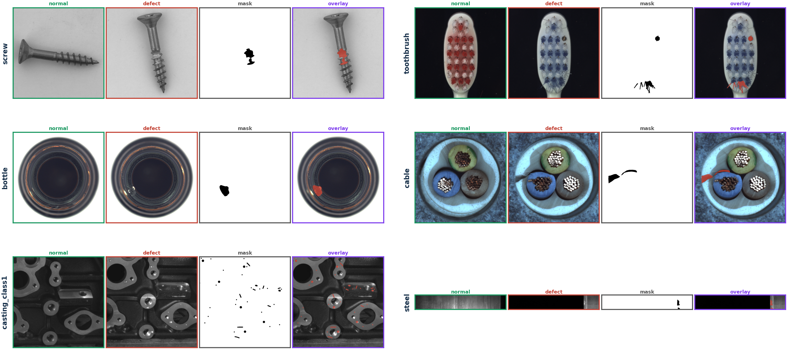
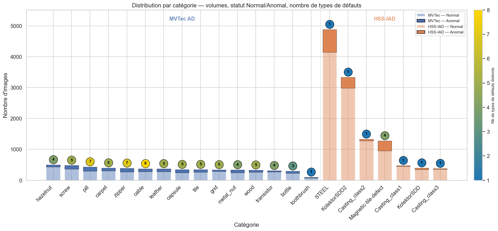
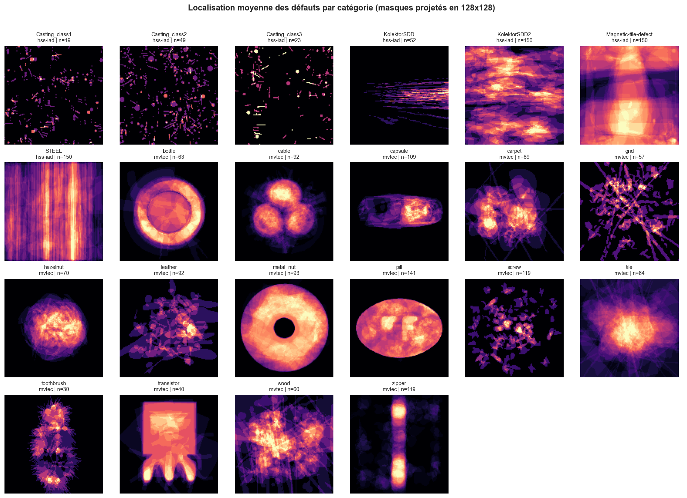
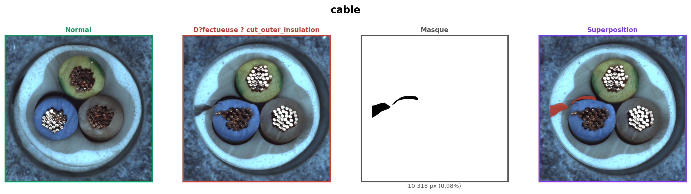

<!-- _class: chapter -->

Soutenance projet industriel

# Détection d'anomalies industrielles

De l'image brute à une décision qualité : détecter une pièce défectueuse et localiser la zone suspecte.

Comprendre les données, préserver le signal utile, puis adapter le modèle au contexte industriel.

---

# Objectifs du projet

<h2>Besoin qualité</h2>

Décider si une pièce est normale ou défectueuse, avec une heatmap exploitable par un inspecteur.

détection image
localisation pixel
faible faux positif
limiter les non conformités

<h2>Livrables data science</h2>

EDA, harmonisation, preprocessing, baselines, modèles avancés, métriques, interprétation et démonstrateur Streamlit.

notebooks
GitHub
rapport
démo

Le score global ne suffit pas : une bonne classification image reste insuffisante si la localisation n'est pas utilisable.

---

# Notre boucle expérimentale

1
<h3>Tester</h3>
Modèle simple ou variante ciblée

2
<h3>Évaluer</h3>
AUROC, AUPIMO, heatmaps, erreurs

3
<h3>Diagnostiquer</h3>
Modèle, preprocessing, ROI ou seuil

4
<h3>Itérer</h3>
Crops, ROI, layers, post-traitement

5
<h3>Décider</h3>
Conserver, abandonner ou spécialiser

<h3>Image AUROC / AP</h3>
Décision pièce normale ou défectueuse.

<h3>Pixel AUROC / AP</h3>
Qualité de localisation de la heatmap.

<h3>AUPIMO</h3>
Localisation exploitable avec peu de faux positifs.

Notre métrique métier centrale devient l’AUPIMO : localiser juste, sans transformer l’inspection en chasse aux faux positifs.

---

# Partie 1 · EDA : à quoi ressemblent les datasets

Ces exemples montrent pourquoi on ne peut pas traiter screw, toothbrush, bottle, cable, casting_class1 et STEEL avec exactement la même préparation image.

---

# EDA : premiers constats mesurés

<h3>MVTec AD</h3>
Benchmark propre, 15 catégories, masques disponibles, structure standard.

<h3>HSS IAD</h3>
Dataset plus difficile, pièces métalliques, défauts subtils, forte variabilité visuelle.

<h3>Décision</h3>
Ne pas lire uniquement une moyenne globale. Les résultats doivent être analysés par catégorie.

17 429 images, 22 catégories, 2 sources : volumes déséquilibrés, résolutions hétérogènes, micro-défauts et défauts parfois hors centre.

---

# Conséquence : pas de preprocessing unique

<h2>Géométrie et ROI</h2>
<ul>
<li>resize contrôlé, éviter le resize agressif 224/256 ;</li>
<li>center_crop seulement quand il ne coupe pas le défaut ;</li>
<li>tiling + stride pour les formats extrêmes ;</li>
<li>variation local / contexte pour garder détail et structure ;</li>
<li>ROI érodée, foreground mask, ROI métier et landmarks.</li>
</ul>

<h2>Robustesse et apprentissage</h2>
<ul>
<li>denoising et filtrage qualité quand le fond domine ;</li>
<li>simulation de défauts pour certaines familles ;</li>
<li>Masked Modeling et Masked Semantic Inpainting comme pistes ;</li>
<li>augmentations : rotations, flip, color-jitter, normalisation photométrique ;</li>
<li>équilibrage et stratification pour évaluer sans moyenne trompeuse.</li>
</ul>

Le preprocessing définit ce que le modèle a le droit de voir et ce que le score doit ignorer.

---

# Acte 2 · Baselines : diagnostiquer avant d'optimiser

| Baseline | Paramètres principaux | Hypothèse | Constat | Décision |
|---|---|---|---|---|
| Autoencodeur | ConvAE, batch 1, 5 epochs, reconstruction image | Une anomalie doit être mal reconstruite | Signal trop diffus, faible pouvoir discriminant | Baseline historique uniquement |
| PatchCore | ResNet18 gelé, layers 2 et 3, tuiles 384, overlap 0.50, kNN euclidien | Une zone anormale est éloignée des patches normaux | Plus robuste et plus local | Baseline forte et interprétable |

Première leçon : le modèle diagnostique une limite, mais il ne peut pas retrouver un défaut détruit par le preprocessing.

---

# Dinomaly change la donne

<h2>Pourquoi ça change</h2>

Dinomaly utilise DINOv2 et reconstruit des features normales plutôt que des pixels. Les défauts topologiques et structurels deviennent plus lisibles.

<h2>Ce qui reste à adapter</h2>

La performance dépend encore du périmètre, de la résolution, des crops, des ROI, du post-traitement et du checkpoint retenu.

Dinomaly améliore nettement MVTec et cable, mais ne résout pas automatiquement STEEL ni Casting.

---

# MVTec : validation benchmark

Avant de conclure sur les cas industriels, on vérifie que le pipeline fonctionne sur un standard reconnu.

<ul>
<li>15 catégories MVTec AD ;</li>
<li>comparaison Dinomaly, PatchCore et approches complémentaires ;</li>
<li>normalisation globale par modèle ;</li>
<li>ensemble Mean : Dinomaly + PatchCore manuel.</li>
</ul>

0.843

AUPIMO moyen avec Ensemble Mean

Dinomaly seul : 0.763. Référence moderne : environ 0.86.

Réussir MVTec ne suffit pas, mais cela prouve que la chaîne est techniquement crédible.

---

# Cable : notre cas de réussite vérifié

| Scénario | Image AUROC | Pixel AUROC | AUPIMO |
|---|---:|---:|---:|
| PatchCore V7 | 0.762 | 0.847 | 0.075 |
| Dinomaly V11 | 0.960 | 0.922 | 0.380 |
| Dinomaly V13 best | 0.957 | 0.927 | 0.443 |
| Dinomaly final 3cat | 0.991 | 0.923 | 0.576 |
| Dinomaly final MVTec | 0.998 | 0.976 | 0.783 |

Cable montre que le triptyque ROI, preprocessing par catégorie et Dinomaly peut produire une localisation beaucoup plus exploitable que la baseline PatchCore.

---

# STEEL : Dinomaly ne suffit pas

<h2>Difficulté</h2>
<ul>
<li>résolution native 256 x 1600, ratio 1:6.25 ;</li>
<li>forte variabilité intra-normal : surfaces lisses, striées, masquées ;</li>
<li>défauts subtils, localisés et peu contrastés ;</li>
<li>les heatmaps peuvent scorer le bruit sain au lieu du défaut.</li>
</ul>

| Étape | Score clé | Lecture |
|---|---:|---|
| ConvAE | AUROC image 0.531 | reconstruction pixel insuffisante |
| DINOv2 / PatchCore | AUROC image 0.572 | transfert limité |
| SuperSimpleNet | AUROC pixel 0.760 | meilleure localisation |
| `tail_mean` | AUROC image 0.638 | meilleure agrégation pixel -> image |

STEEL est un échec informatif : la difficulté vient autant de l'agrégation et de la variabilité saine que du choix du backbone.

---

# Casting : ROI métier + Reverse Distillation calibré

<h2>Pourquoi c'est difficile</h2>
<ul>
<li>micro-défauts, trous, bords et filetages proches des anomalies ;</li>
<li>plusieurs patterns de vue dans Casting_class1 ;</li>
<li>le resizing global dilue les défauts ;</li>
<li>avant de détecter, il faut apprendre où regarder.</li>
</ul>

<h2>Réponse retenue</h2>
<ul>
<li>ROI de surface fonctionnelle pour isoler la zone inspectable ;</li>
<li>séparation ROI d'affichage / ROI de scoring ;</li>
<li>Reverse Distillation sur features normales ;</li>
<li>calibration post-hoc : layer2 0.65, layer3 0.35, top-k 0.005.</li>
</ul>

image AP 0.8461 · pixel AP 0.2251 · AUPIMO 0.0571

---

# Lecture transversale des trois classes

| Classe | Preprocessing clé | Modélisation | Résultat / limite |
|---|---|---|---|
| Cable | ROI, érosion, crops adaptés | Dinomaly | réussite nette, AUPIMO final 3cat 0.576 |
| STEEL | tuilage, masque steel, agrégation robuste | SuperSimpleNet + `tail_mean` | pixel AUROC 0.760, image AUROC 0.638 |
| Casting | ROI métier, landmarks, scoring local | Reverse Distillation calibré | image AP fort, localisation encore limitée |

La conclusion scientifique n'est pas “un meilleur modèle pour tout”, mais “une stratégie par catégorie selon géométrie, défauts et usage qualité”.

---

# Ce que nous avons réellement appris

<h2>Le modèle compte</h2>

PatchCore, PaDiM et Dinomaly ne font pas le même compromis entre texture locale, structure globale et reconstruction de features.

<h2>Mais la chaîne compte plus</h2>

ROI, crops, résolution utile, seuils, post traitement et choix du checkpoint changent directement la qualité des heatmaps.

La performance utile vient de l’alignement entre données, preprocessing, métrique et usage qualité.

---

<!-- _class: chapter -->

Conclusion

# Notre épopée en une phrase

Nous sommes partis d’une détection générique d’anomalies, et nous avons construit progressivement une chaîne plus métier : regarder les bonnes zones, comparer les modèles avec les bonnes métriques, puis stabiliser la décision.

Pour détecter correctement un défaut industriel, il ne suffit pas d’avoir un bon modèle : il faut préserver le signal utile et apprendre au pipeline où regarder.

Transition démo : image brute, preprocessing / ROI, modèle, heatmap, score image, masque de référence, décision qualité.

